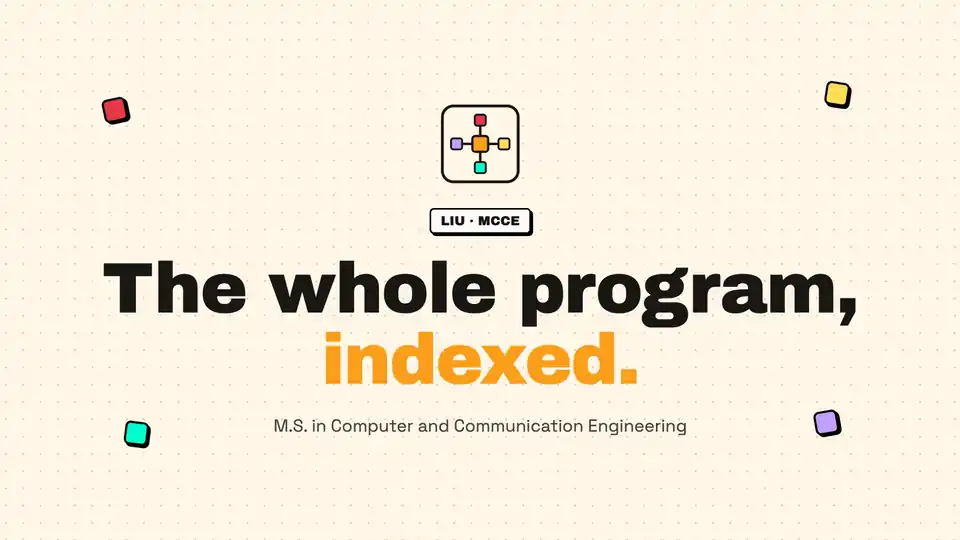

<h1 align="center">MCCE</h1>

  An independent index and study toolkit for the LIU M.S. in Computer and Communication Engineering program.

  

  
  
  
  

  
  
  

  

---

## What this is

Course material for the MCCE program moves through a few channels before it reaches a student,
and each one loses something along the way. Instructors post to Classroom, which is the official
source but is mostly slides and files with no notes, past exams, or exercises. Students fill the
gaps in WhatsApp group chats, which helps but is hard to search, hard to keep current, and not
available to everyone in the program.

MCCE indexes the shared Drive folders behind both of those channels into one place: a site to
browse, search, and link to material by semester and course. It re-syncs from Drive on a weekly
schedule, so the index tracks what's actually shared without anyone maintaining it by hand.
Alongside the index, it carries the parts of the program that are otherwise scattered across
PDFs and screenshots: the plan of study, the prerequisite roadmap, a GPA calculator on the
program's grading scale, the admissions flow, and the tuition numbers with a planner to work
a year's fees out from them. A PDF editor opens any indexed PDF in the browser to mark it up,
and a tools directory covers what is worth installing for the coursework and the thesis.

This is an independent, student-built site. It is not an official page of Lebanese International
University. For admissions, curriculum, and official program details, see the
[official program page](https://cce.liu.edu.lb/academic-programs/graduate-programs).

**[mcce.khaledsaeed.tech](https://mcce.khaledsaeed.tech)**

## Shared Drive folders

Direct links to the three shared Google Drive folders:

- [LIU | MCCE 1 (First Year)](https://drive.google.com/drive/folders/15A8bxA33GichTPcZkyXxaZnP_dRyryTq): materials, exercises, and previous exams for both Fall and Spring semesters.
- [LIU | MCCE 2.1 (Second Year, Fall Semester)](https://drive.google.com/drive/folders/1O5i5a7CgmPEwQ7G6MFyM75zIfmtDi5pt): materials, exercises, and previous exams for the fall semester.
- [LIU | MCCE 2.2 (Second Year, Spring Semester)](https://drive.google.com/drive/folders/1Ed1qu98go160SHcte4FstkPVhxX9pRK1): materials, exercises, and previous exams for the spring semester.

## Features

- **Browse by source and course**: program materials organized by Drive source, semester, and
  course, with folder and file counts at a glance.
- **Search**: find material by name, filtered by semester, course, material type, or file type.
- **Command palette**: press `Cmd+K` or `Ctrl+K` to jump straight to a file from anywhere on the
  site, with recently opened files listed before you type.
- **File previews**: preview documents, slides, sheets, and text files without leaving the site.
- **PDF editor**: open any indexed PDF in the browser and draw, type, and add boxes and circles,
  in five colours with undo and redo. Rotate, reorder, copy, or remove pages from a thumbnail
  rail, then save a marked-up copy. Markup is kept per file in the browser, and the file in Drive
  never changes. Opens from any PDF preview or from the menu, works full screen, has keyboard
  shortcuts for every tool, and needs a desktop-width screen.
- **Past exams**: every indexed midterm, final, and assessment in one view, grouped by course and
  by the term it was sat, with papers that record no year kept at the end of each course.
- **Saved files**: keep a shortlist of files while browsing. It stays in the browser.
- **Course pages**: one page per course with its description, objectives, topics, credits,
  prerequisites and corequisites, the other courses sat in the same semester, and every indexed
  file for it.
- **Plan of study**: a year-by-year curriculum view with semester groups, course requirements,
  and prerequisite notes.
- **Curriculum roadmap**: a traceable prerequisite graph across the full program, with credit
  totals per year and semester.
- **GPA calculator**: semester and cumulative GPA on the program's 4.0 scale, with a trend chart,
  an end-of-program projection, and the course average needed to reach a target. A share link
  carries a set of averages to someone else. Entries stay in the browser, nothing is sent
  anywhere.
- **Admissions guide**: the graduate admissions flow in one place, with the documents and fees
  required, separate step-by-step tracks for LIU and non-LIU bachelor graduates, the GPA bar for
  each, the application window, and the offices to contact.
- **Tuition and fees**: the official per credit and per year rates in both USD and LBP, plus a
  planner that turns the credits you intend to take each semester into semester and year totals,
  with registration and NSSF charges, a financial aid percent applied the way LIU bills it, and
  an option to convert the LBP side at a rate you set.
- **CCE undergraduate programs**: a reference page for the department's two bachelor programs,
  Computer Engineering (CENG) and Communications Engineering (TENG), with both plans of study,
  the electives, and the one course where the two tracks differ.
- **Tools directory**: about 400 external tools for the program in 26 categories, each with a
  cost badge (Free, Freemium, Trial, Paid, Student) and an Open Source flag, filterable by badge
  and searchable, with a thesis toolkit ordered by stage and an index of about 280 public GitHub
  repositories with their licence class and maintenance state.
- **Exports**: download, preview, or share the plan of study, a GPA report, or a tuition plan as
  a PDF. The GPA report and the tuition plan also export as CSV or JSON.
- **Weekly auto-sync**: a scheduled job re-crawls the source Drive and updates the index, so
  material doesn't go stale.
- **Recently added**: what each sync picked up, grouped by course, with an RSS feed to follow.
- **Open in Drive**: direct links into the shared Drive folders, from the home page, the footer,
  the sitemap, each course year, and any folder being browsed, for when the index is not the
  fastest way in.
- **FAQ and about pages**: how the program is structured, and how syncing, search, and file
  access work here.
- **Community-sourced contributions**: anyone in the program can send exams, notes, slides, or
  recordings through the contact page to be added to the index.
- **Works offline**: the index is cached on first visit, so browsing and search keep working with
  no connection, no sign-in, and no tracking.
- **Installable**: works as a standalone app on desktop and mobile through the site manifest.
- **Light and dark themes**: follows the system setting, or toggle it with the `D` key.

## Contributing

Contributions are welcome, whether that's code, a bug report, or course material to add to the
index. See [CONTRIBUTING.md](./CONTRIBUTING.md) for the tech stack, project structure, local
setup, and the standards a pull request is held to.

To contribute course material instead of code, use the
[contact page](https://mcce.khaledsaeed.tech/contact).

## License

MIT, see [LICENSE](./LICENSE).
