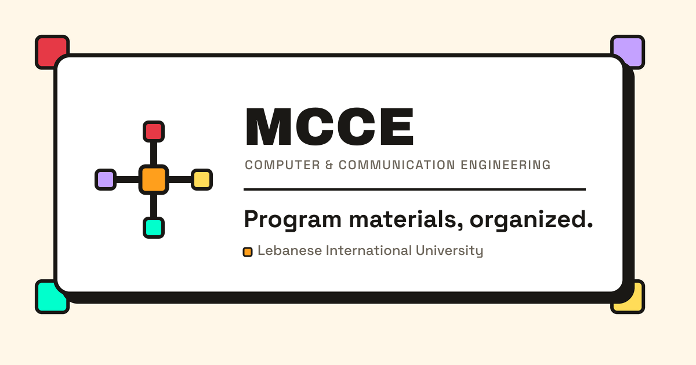

  

<h1 align="center">MCCE</h1>

  A materials browser for the LIU M.S. in Computer and Communication Engineering program.

  
  
  
  
  
  

---

## What this is

Course material for the MCCE program moves through a few channels before it reaches a student,
and each one loses something along the way. Instructors post to Classroom, which is the official
source but is mostly slides and files with no notes, past exams, or exercises. Students fill the
gaps in WhatsApp group chats, which helps but is hard to search, hard to keep current, and not
available to everyone in the program.

MCCE indexes the shared Drive folders behind both of those channels into one place: a site to
browse, search, and link to material by semester and course. It re-syncs from Drive on a weekly
schedule, so the index tracks what's actually shared without anyone maintaining it by hand.

This is an independent, student-built site. It is not an official page of Lebanese International
University. For admissions, curriculum, and official program details, see the
[official program page](https://cce.liu.edu.lb/academic-programs/graduate-programs).

**[mcce.khaledsaeed.tech](https://mcce.khaledsaeed.tech)**

## Features

- **Browse by source and course** — program materials organized by Drive source, semester, and
  course, with folder and file counts at a glance.
- **Search** — find material by name, filtered by semester, course, or file type.
- **File previews** — preview documents, slides, and sheets without leaving the browser.
- **Plan of study** — a year-by-year curriculum view with semester groups, course requirements,
  and prerequisite notes.
- **Curriculum roadmap** — a traceable prerequisite graph across the full program, with credit
  totals per year and semester.
- **PDF export** — download, preview, or share the full plan of study as a PDF.
- **Weekly auto-sync** — a scheduled job re-crawls the source Drive and updates the index, so
  material doesn't go stale.
- **Community-sourced contributions** — anyone in the program can send exams, notes, slides, or
  recordings through the contact page to be added to the index.
- **Installable** — works as a standalone app on desktop and mobile through the site manifest.

## Contributing

Contributions are welcome, whether that's code, a bug report, or course material to add to the
index. See [CONTRIBUTING.md](./CONTRIBUTING.md) for the tech stack, project structure, local
setup, and the standards a pull request is held to.

To contribute course material instead of code, use the
[contact page](https://mcce.khaledsaeed.tech/contact).

## License

MIT, see [LICENSE](./LICENSE).
